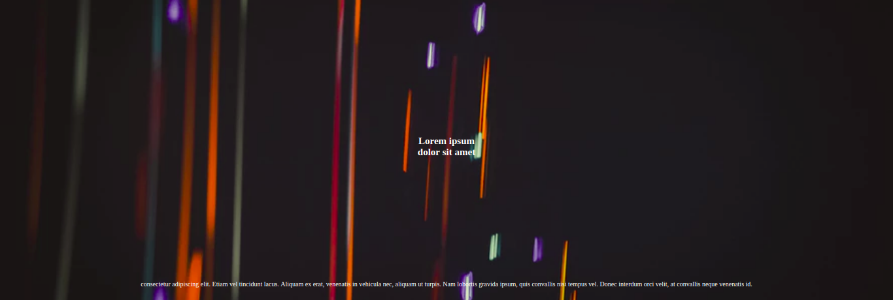

# HUGO Titi

## _Keep it simple, but not simpler_

**Titi** is a Hugo theme written by [Datasketch](https://datasketch.co)

Originally forked https://github.com/yihui/hugo-xmin.

Give it a try, clone this repository and type the following command on your terminal:

```sh
# You must have hugo installed
$ hugo server -s exampleSite
```

## Site Configuration
### Navbar
Configure the navbar aspect and items.

If the `logo` option is not set, it will be placed the site name instead.

```toml
# config.toml
...
[params]
  [params.nav]
    # navbar background color
    bg = ""
    # navbar text color
    color = ""
    # navbar logo
    logo = "path/to/image"
    # navbar logo width
    logoWidth = "150px"
    # override fixed navbar behavior (optional)
    fixed = false
```
This theme has two kind of menus enabled.
1. Burger menu

```toml
# config.toml
...
[menu]
  [[menu.burger]]
    # name to be displayed
    name = ""
    url = ""
    # position of the link inside the burger menu
    weight = 1
  [[menu.burger]]
    name = ""
    url = ""
    weight = 2
```
2. Navbar menu: place the links directly in the navbar

```toml
# config.toml
...
[menu]
  [[menu.nav]]
    name = ""
    url = ""
    weight = 1
```

### Social icons
Icons are pulled from [Font Awesome 4.7](https://fontawesome.com/v4.7.0/icons/). This way, you can use any icon listed on their page. These icons are placed in the right side of the navbar.

By default the links are opened in a new tab. If you wish them to be opened in the same tab, then use `external = false`.

```toml
# config.toml
...
[params]
  [[params.social]]
    # font awesome icon name
    icon = "twitter"
    url = "https://twitter.com/username"
    # external link management (optional)
    external = false
  [[params.social]]
    icon = "facebook"
    url = "https://www.facebook.com/username/"
  [[params.social]]
    icon = "instagram"
    url = "https://www.instagram.com/username/"
```

### Footer
Configure the footer content.

```toml
# config.toml
...
[params]
  [params.footer]
    # footer text
    text = ""
    # footer background color
    bg = ""
    # footer text color
    color = ""
```
## Shortcodes
## anchor
The anchor shortcode changes the color of the `<a>` tag returned by the markdown parser. It works along with the `higlight` color parameter, if available, in the front matter configuration of your posts.

```md
---
title: "Sample post"
highlight: "red"
---

 Anchor text 
```

## quote
Same as [anchor](#anchor)

```md
---
title: "Sample post"
highlight: "red"
---

 Quote text 
```

## banner
Render a banner and can be used with the following parameters:

:bookmark:: Accepts markdown syntax

+ height - height of the banner in percentage **(required)**
+ image - background image
+ bg - background color
+ color - text color
+ title - banner title :bookmark:
+ subtitle - banner subtitle :bookmark:

Also, a description (:bookmark:) can be given inside the body of the shortcode. For example, in order to achieving a banner like the following is possible with the code shown.



```md

  consectetur adipiscing elit. Etiam vel tincidunt lacus. Aliquam ex erat, venenatis in vehicula nec, aliquam ut turpis. Nam lobortis gravida ipsum, quis convallis nisi tempus vel. Donec interdum orci velit, at convallis neque venenatis id.

```

## iframe
Use this shortcode to embed a document within the current document. It could receive three parameters: `url`, `width` and `resize`.

By default, the width is set to 100%, however, if you set a different value, the height of the iframe will be calculated to maintain a 16:9 aspect ratio unless the `resize` option is set to `"true"`. In this case, the shortcode will use the [iFrame Resizer library](https://github.com/davidjbradshaw/iframe-resizer) to automatic resizing the contained content.

```md
<!-- Embed iframe with 100% width -->
{{ < iframe url="http://example.com" >}}
<!-- Embed iframe with 80% width -->

<!-- Embed iframe with 100% width and auto resize -->
{{< iframe url="http://example.com" resize="true" }}
<!-- Embed iframe with 60% width and auto resize -->
{{< iframe url="http://example.com" width="60" resize="true" }}
```

:information_source: _Note that for embeding videos from Vimeo or Youtube is better to use Hugo's built-in shortcodes `` and ``._

## slider
This shortcode defines the main container of a slider. The inner body must only contain `slide` shortcode items, which are [defined later in the document](#slide).

It can be used with the following parameters:

+ height - define slider height in percentage
+ navigation - add navigation arrows to the slider
+ pagination - add pagination bullets to the slider
+ loop - enable continuous loop mode
+ autoplay - enable slider autoplay in seconds
+ pc - numbers of slides per view in pc
+ tablet - numbers of slides per view in tablet
+ mobile - numbers of slides per view in mobile
+ gap - space between slides

```md

  ...

```
:information_source: _This shortcode is powered by the awesome [Swiper](https://github.com/nolimits4web/swiper) library._

## slide
This shortcode defines a slide within a [slider container](#slider). It can be used with the following parameters:

:bookmark:: Accepts markdown syntax

+ bg - slide background color
+ color - slide text color
+ image - slide background image
+ title - slide title (:bookmark:)

Also, a text (:bookmark:) can be given inside the body of the shortcode.

```md

  
  Slide 2 text

```
:information_source: _This shortcode is powered by the awesome [Swiper](https://github.com/nolimits4web/swiper) library._

## boxes
This shortcode defines the main container for individiual `box` shortcode items, which are [defined later in the document](#box). This shortcode allows to split the screen into 12 columns.

It can be used with the following parameters:

+ bg - background color
+ color - text color
+ height - min height
+ justify - start, center, end, between, around.
+ align - start, center, end.

```md


```

## box
This shortcode defines a box within a [boxes container](#boxes). It can be used with the following parameters:

+ mobile - number of columns in mobile
+ tablet - number of columns in tablet
+ pc - number of columns in pc
+ bg - box background color
+ color - box text color

```md

  1
  2
  3
  4

```
